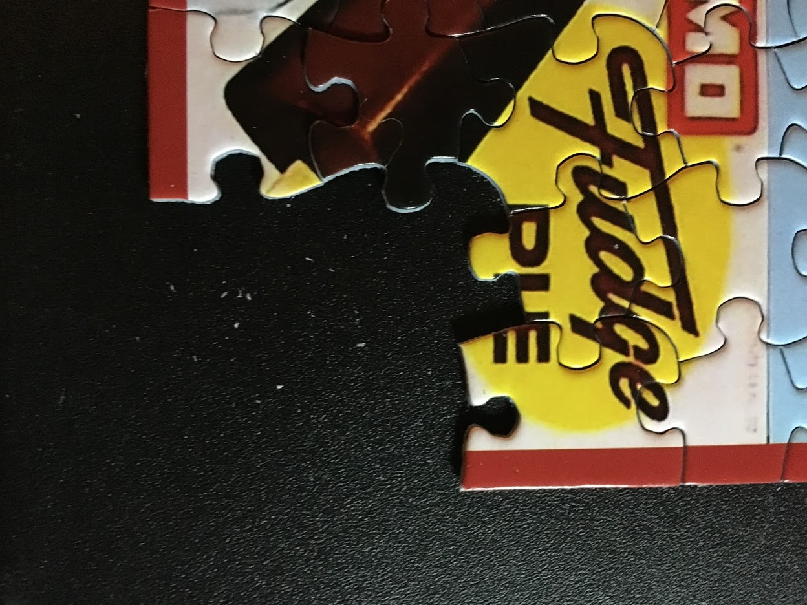
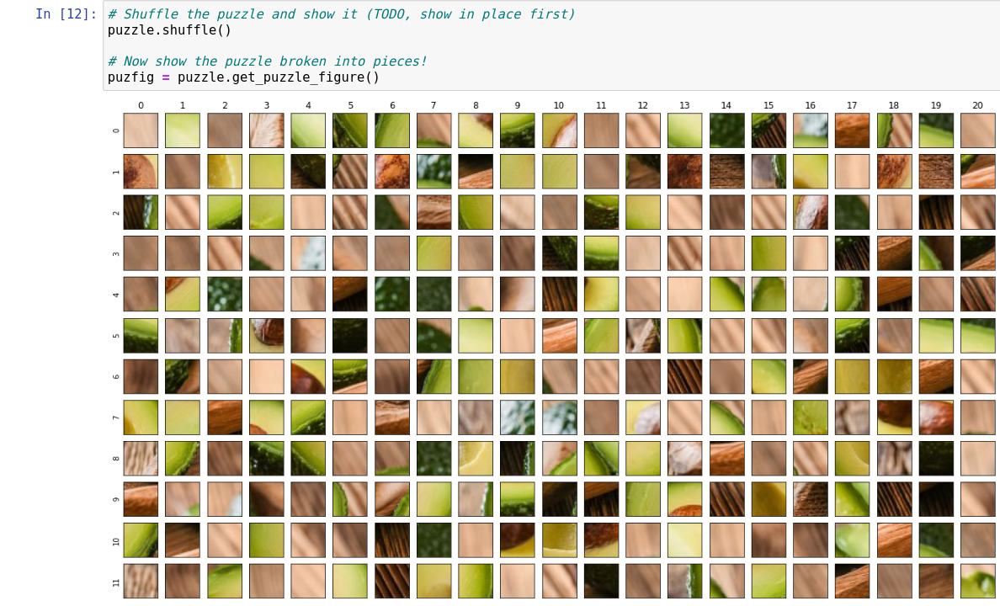
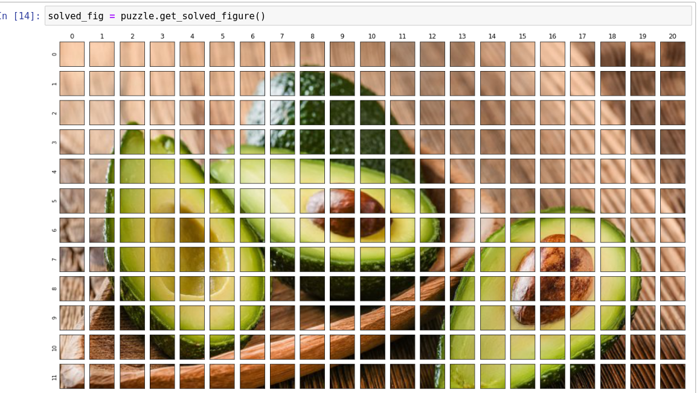

# Puzzles

I've recently taken up a fondness for puzzles. Over a conversation one night,
we joked how cool it would be to have a digital puzzle. It actually
wouldn't be such a crazy idea - each puzzle piece would need to have some sort of
tiny sensor to understand it's location relative to the others, and some tiny
digital display that a mapped portion of an image would be shown on. Given that
we have something like the Kindle, the technology for "long lasting and low power
images" didn't seem that far off.

| Pieces                          | Puzzle                                    |
|---------------------------------|-------------------------------------------|
||  |

> Sometimes, you just feel out of place.

But the use of sensors is a bit out of my budget and current knowledge base. But
that's okay, let's work up to that. As I usually do, I thought of breaking the 
problem into smaller pieces (pun intended). Perhaps there is a similar problem 
I can solve that would be a step in the right  direction? 
How about a robot that solves puzzles? 

## High Level Algorithm

A "robot puzzle solver" means that we do the following

 1. We start with pictures of separate images
 2. The puzzle pieces are segmented.
 3. We represented features and edges of the pieces.
 4. Based on these features, the segmented pieces are put together by an algorithm. 

But more realistically, we want to start with a simpler problem:

 1. We start with an entire image and break it into N squares
 2. We match sides based on colors
 3. We represented features and edges of the pieces.
 4. Based on these features, the segmented pieces are put together by an algorithm.


## Variables

Some things we would need to account for in the above (and these are general notes 
for now).

 - the puzzle pieces would ideally have consistent lighting and all be turned with picture upwards.
 - the camera, even from the top down, would introduce a bit of skew, both for shape and for color.
 - we can't make any assumption about the shape or position of the pieces. This means that although we could represent an edge as some sort of curve, the second you introduce a weirdo pieces that doesn't work well with the assumption, the algorithm breaks. For this reason, we might consider a pixel-based approach.
 - It could be the case that the algorithm can solve a puzzle as would a human - perhaps the edge pieces are easiest to do first, and then work from corners in?
 - We could do a recursive backtracking approach, where we start with edges, then work inwards from the corners, and choose the most probable piece given each new location with two "decided" edges. But as soon as the probabilities of a correct piece drop below some threshold, we should turn back.
 - Puzzles are real, and thus inherently imperfect. There needs to be an allowed margin of error.

## Applications

As silly as this is, there are some fun applications for a robot puzzle solver.

 - Puzzles are currently ranked on number of pieces, but I've found this isn't a good representation for how difficult they are. The robot puzzle solver could come up with a metric that represents difficulty based on the algorithm.
 - Has anyone ever wondered how much harder it is to solve a puzzle if you are color blind? Given a metric of difficulty, we can see how that changes with different variables removed. For example, if we remove color, how much longer does the algorithm take?

# Puzzle Solver

The puzzle solver currently loads in a photo, and can shuffle it and then re-discover
the solution. I haven't tested this on a huge number of images so your mileage may vary,
and note that I still consider the library under development.
Here is the basic usage, and you should also check out the [examples/avocado-puzzle.ipynb](examples/avocado-puzzle.ipynb)

```python
from puzzles.main.models import PhotoPuzzle

puzzle = PhotoPuzzle("avocado-halves.jpeg")

# Show the original image
fig = puzzle.get_image_figure()

# Metrics about the puzzle calculated based on minimum piece size we requested

puzzle.metrics()
# Image file         : avocado-halves.jpeg
# Minimum piece size : 30
# Width              : 640
# Height             : 360
# Number pieces      : 252

# Shuffle the puzzle and show it (TODO, show in place first)
puzzle.shuffle()

# Now show the puzzle broken into pieces!
puzfig = puzzle.get_puzzle_figure()

solved_fig = puzzle.get_solved_figure()
```

Here is the shuffled puzzle:



And then solved!



In practice I've found that the original shuffle can lead to a different result
(e.g., a slightly not perfect solution).

## Changes

In case you want to contribute here are some ideas!

### Puzzle Pieces

I'd like there to be a model of a `PuzzlePiece` that holds the piece data, and then comparisons 
between pieces are done in this manner. Right now we have a `PlacedPiece` which really just
holds an index into the array self.pieces and a location (x,y) in terms of coordinates
on the board. It would be cleaner to somehow combine these two.

### Image Loading

Currently, if we display the image before shuffle it actually isn't perfect.
But I think it should be (and this is a bug) we would want to be able to
display the image, see that it's correct, and then shuffle.


### Display Functions

Currently we have redundant logic in the functions to show the puzzle pieces
in their current array, and then the solved solution. This should be
refactored into a shared display function.
